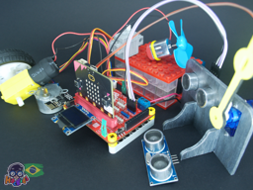

<a href="https://hackids.com.br/suporte/boards/hackbit/"></a>
# HACK:BIT block package 
<a href=""></a>
powered by micro:bit | made in Brazil

https://hackids.com.br/suporte/boards/hackbit/

 
 
 
 
 
 




# Description
Biblioteca para sensores, atuadores, displays, LEDs e motores utilizados em conjunto com a placa hack:bit.
The package adds support hack:bit board.

  

# Examples | Exemplos
### Stepper motor
```JavaScript
input.onButtonPressed(Button.A, function () {
    basic.showString("A")
    for (let index = 0; index < 4; index++) {
        hackbitmotors.StepperDual(360, 360)
    }
})
input.onButtonPressed(Button.B, function () {
    basic.showString("B")
    for (let index = 0; index < 4; index++) {
        hackbitmotors.StepperDual(-360, -360)
    }
})
```
### Traffic Light
```JavaScript
hackbit.ledState(DigitalPin.P0, hackbit.OnOff.Off)
hackbit.ledState(DigitalPin.P1, hackbit.OnOff.Off)
hackbit.ledState(DigitalPin.P2, hackbit.OnOff.Off)
basic.forever(function () {
    hackbit.ledState(DigitalPin.P0, hackbit.OnOff.On)
    basic.pause(10000)
    hackbit.ledState(DigitalPin.P0, hackbit.OnOff.Off)
    hackbit.ledState(DigitalPin.P2, hackbit.OnOff.On)
    basic.pause(6000)
    hackbit.ledState(DigitalPin.P2, hackbit.OnOff.Off)
    hackbit.ledState(DigitalPin.P1, hackbit.OnOff.On)
    basic.pause(4000)
    hackbit.ledState(DigitalPin.P1, hackbit.OnOff.Off)
})
```

### Grove Ultrassonic 3V3
```JavaScript
HackbitOLEDDisplay.init(128, 64)
HackbitOLEDDisplay.writeString("Hackids")
basic.pause(2000)
HackbitOLEDDisplay.clear()
basic.forever(function () {
    HackbitOLEDDisplay.writeNum(hackbit.measureDistance(DigitalPin.P8, hackbit.DistanceUnit.cm))
    basic.pause(1000)
    HackbitOLEDDisplay.clear()
})
```

### Ultrassonic HC-SR04 5V
```JavaScript
basic.forever(function () {
    led.enable(false)
    serial.writeValue("x", hackbit.us_sonar(
    DigitalPin.P13,
    DigitalPin.P8,
    hackbit.PingUnit.cm
    ))
    basic.pause(500)
})
```

### DHT11
```JavaScript
led.enable(false)
hackbit.selectTempType(hackbit.tempType.celsius)
basic.forever(function () {
    hackbit.queryData(
    hackbit.DHTtype.DHT11,
    DigitalPin.P14,
    true,
    false,
    true
    )
    serial.writeValue("umidade", hackbit.readData(hackbit.dataType.humidity))
    serial.writeValue("temperatura", hackbit.readData(hackbit.dataType.temperature))
    basic.pause(2000)
})
```

### PIR Sensor - Intrusion Detection
```JavaScript
led.enable(false)
HackbitOLEDDisplay.init(128, 64)
HackbitOLEDDisplay.writeString("hack:bit")
HackbitOLEDDisplay.newLine()
HackbitOLEDDisplay.writeString("PIR Test - P7")
HackbitOLEDDisplay.newLine()
HackbitOLEDDisplay.writeString("LED - P10")
HackbitOLEDDisplay.newLine()
HackbitOLEDDisplay.writeString("Sound - Int")
basic.pause(5000)
HackbitOLEDDisplay.clear()
music.setVolume(255)
hackbit.ledState(DigitalPin.P10, hackbit.OnOff.On)
basic.forever(function () {
    if (hackbit.PIRState(DigitalPin.P7)) {
        hackbit.ledState(DigitalPin.P10, hackbit.OnOff.On)
        HackbitOLEDDisplay.newLine()
        HackbitOLEDDisplay.writeString("Detect intrusion")
        soundExpression.giggle.playUntilDone()
        basic.pause(1000)
        HackbitOLEDDisplay.clear()
    } else {
        hackbit.ledState(DigitalPin.P10, hackbit.OnOff.Off)
        HackbitOLEDDisplay.newLine()
        HackbitOLEDDisplay.writeString("Safe environment")
        basic.pause(1000)
        HackbitOLEDDisplay.clear()
    }
})
```
### Servo 
```JavaScript
basic.forever(function () {
    hackbitmotors.Servo(hackbitmotors.Servos.S1, pins.map(
    input.temperature(),
    0,
    255,
    0,
    180
    ))
    basic.pause(100)
})
```

### Geek Servo 2Kg
```JavaScript
basic.showIcon(IconNames.Ghost)
hackbitmotors.GeekServo2KG(hackbitmotors.Servos.S1, 157)
basic.pause(500)
hackbitmotors.GeekServo2KG(hackbitmotors.Servos.S2, 261)
basic.pause(500)
hackbitmotors.GeekServo2KG(hackbitmotors.Servos.S3, 135)
basic.pause(500)
hackbitmotors.GeekServo(hackbitmotors.Servos.S4, 44)
basic.pause(2000)
hackbitmotors.GeekServo2KG(hackbitmotors.Servos.S1, 180)
hackbitmotors.GeekServo2KG(hackbitmotors.Servos.S2, 180)
hackbitmotors.GeekServo2KG(hackbitmotors.Servos.S3, 180)
hackbitmotors.GeekServo2KG(hackbitmotors.Servos.S4, 180)
basic.pause(5000)
basic.forever(function () {
    basic.pause(randint(100, 200))
    hackbitmotors.GeekServo2KG(hackbitmotors.Servos.S1, randint(0, 50))
    basic.pause(randint(100, 1000))
    hackbitmotors.GeekServo2KG(hackbitmotors.Servos.S2, randint(300, 360))
    basic.pause(randint(100, 1000))
    hackbitmotors.GeekServo2KG(hackbitmotors.Servos.S3, randint(100, 150))
    basic.pause(randint(100, 1000))
    hackbitmotors.GeekServo2KG(hackbitmotors.Servos.S4, randint(200, 350))
    basic.pause(randint(100, 1000))
})
```

## hack:bit Pin Assignment
<a href="https://hackids.com.br/suporte/boards/hackbit/"></a>
<a href="https://hackids.com.br/suporte/boards/hackbit/"></a>


## License

MIT

Copyright (c) 2020, Hackids Editora Educacional Ltda

## Supported targets

* for PXT/microbit

---

Made with &#x2764;&nbsp; by [**Hackids**](https://www.hackids.com.br) - Londrina - Brazil.

```package
hackbit=github:HackidsEdu/pxt-hackbit
```