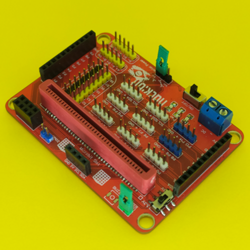

<a href="https://www.hackids.com.br/"></a>

# HACKBIT block package for hack:bit expansion board
powered by micro:bit

Biblioteca para sensores, atuadores, displays, LEDs e motores utilizados em conjunto com a placa hack:bit
https://www.hackids.com.br

  
  

# Examples

## Code Example
```JavaScript
```

## Blocks preview


## Pinout
<a href="https://hackids.com.br/suporte/boards/hackbit/"></a>
<a href="https://hackids.com.br/suporte/boards/hackbit/"></a>


#### Metadata (used for search, rendering)

## License

MIT

Copyright (c) 2020, Hackids Editora Educacional Ltda

## Supported targets

* for PXT/microbit

## Path
* https://github.com/hackidsedu/pxt-hackbit

---

Made with &#x2764;&nbsp; by [**Hackids**](https://www.hackids.com.br) - Londrina - Brazil.
